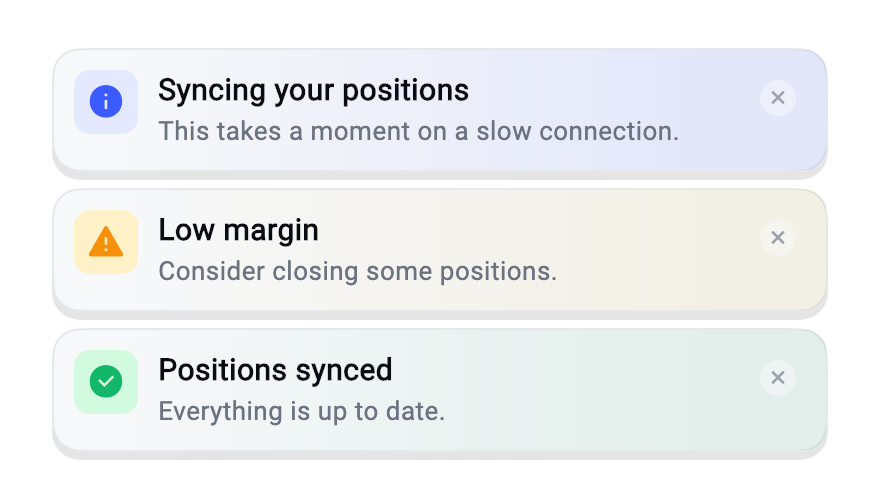
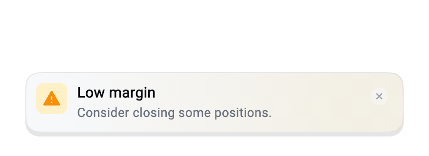
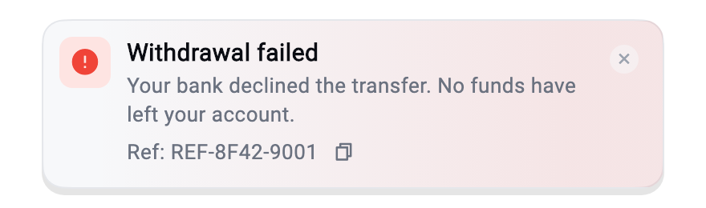
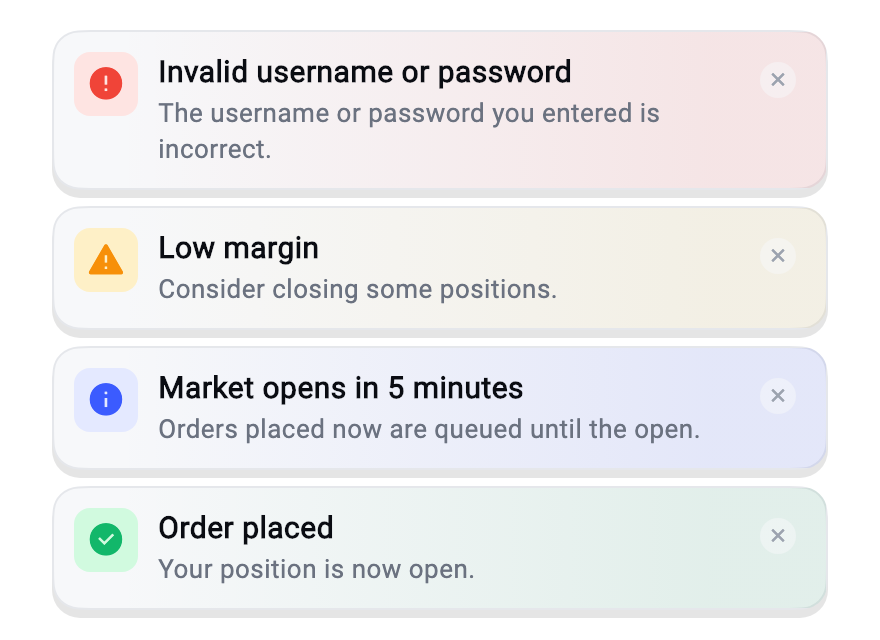
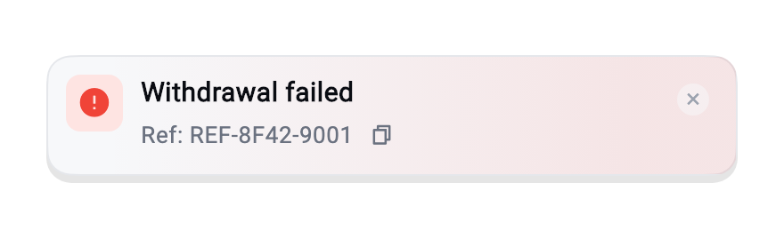

# toast_overlay

An animated, themeable overlay toast for Flutter — with an auto-dismiss
countdown ring, and an optional support **reference id** the user can copy.

Unlike a `SnackBar`, it renders into the root `Overlay`, so it shows above
dialogs and bottom sheets and survives route changes. It has **no dependency on
your app's theme, assets or localisations** — you inject those.

| Three stacked at the top | One anchored to the bottom | A reference id, with a subtitle above it |
| --- | --- | --- |
|  |  |  |

One card per status:



## Install

```bash
flutter pub add toast_overlay
```

Or add it to `pubspec.yaml` yourself — it is a runtime dependency:

```yaml
dependencies:
  toast_overlay: ^1.1.0
```

then:

```bash
flutter pub get
```

### Requires `package:material_ui`

Since 1.0.0 this package builds on [`material_ui`][material_ui], the standalone
Material library, rather than `package:flutter/material.dart`. The two declare
separate types, so your app has to be on `material_ui` as well — otherwise
`ToastTheme` cannot be registered in your `ThemeData`.

If your app still imports `package:flutter/material.dart`, migrate it with
Flutter's own fix:

```bash
dart fix --apply --code=migrate_design_widgets
```

Staying on `package:flutter/material.dart` for now? Use `toast_overlay: ^0.3.0`.

[material_ui]: https://pub.dev/packages/material_ui

## Use

Initialise once with your root navigator key:

```dart
final navigatorKey = GlobalKey<NavigatorState>();

MaterialApp(navigatorKey: navigatorKey, /* … */);

Toast.init(navigatorKey: navigatorKey);
```

Then, from anywhere:

```dart
Toast.show(
  status: ToastStatus.success,
  title: 'Order placed',
  subtitle: 'Your position is now open.',
);
```

| Parameter | Default | Meaning |
| --- | --- | --- |
| `status` | — | `error`, `success`, `info`, `warning` |
| `title` | — | Falls back to the status default when empty |
| `subtitle` | null | Secondary line, up to 3 lines |
| `referenceId` | null | Shown with a copy button; **disables auto-dismiss** |
| `position` | `top` | `top` or `bottom` |
| `offset` | `kToolbarHeight` | Distance from the anchored edge |
| `duration` | 3s | `null` keeps it up until dismissed |

## Stacking

By default each toast replaces the one on screen. Raise `maxStack` and they
stack against their edge instead — the oldest drops off once the limit is hit:

```dart
Toast.init(
  navigatorKey: navigatorKey,
  maxStack: 3,      // 1 (the default) replaces instead of stacking
  stackSpacing: 8,  // gap between two cards
);
```

Top-anchored and bottom-anchored toasts stack separately, each against its own
edge, and only the card nearest the edge keeps its `offset`.

## Reference ids

On an error you often want to hand the user something to quote to support. Pass
a `referenceId` and the toast renders `Ref: <id>` with a copy button — and
**stops auto-dismissing**, because a toast that vanishes while you are copying
it is useless. It sits under the `subtitle` when you pass both.

```dart
Toast.show(
  status: ToastStatus.error,
  title: 'Withdrawal failed',
  referenceId: response.traceId,
);
```



## Theming

Register a `ToastTheme` extension and the toast follows your light and dark
themes:

```dart
MaterialApp(
  theme: ThemeData(extensions: const [ToastTheme(
    surface: Color(0xFFF7F8FA),
    borderColor: Color(0xFFE5E7EB),
    titleColor: Color(0xFF0A0C12),
    subtitleColor: Color(0xFF6B7280),
    closeIconColor: Color(0xFF9CA3AF),
    statusColors: {
      ToastStatus.success: ToastStatusColors(
        background: Color(0xFFD1FADF),
        foreground: Color(0xFF12B76A),
      ),
      // …
    },
  )]),
);
```

**If you register nothing, it still works** — the palette is derived from the
ambient `ColorScheme`.

### Corners

`cardRadius` and `iconRadius` are `BorderRadius`, so corners can differ — 12 and
6 all round by default:

```dart
ToastTheme(
  // …
  cardRadius: BorderRadius.circular(20),
  iconRadius: const BorderRadius.only(
    topLeft: Radius.circular(16),
    bottomRight: Radius.circular(16),
  ),
);
```

Pass `cardShape` or `iconShape` instead when you want a shape of your own; they
override the radii.

### Type

`fontFamily` swaps the typeface on every line. For finer control, `titleStyle`,
`subtitleStyle` and `referenceStyle` are used exactly as given — a weight,
colour or family you set there is never overwritten:

```dart
ToastTheme(
  // …
  fontFamily: 'Inter',
  titleStyle: TextStyle(fontSize: 15, fontWeight: FontWeight.w700),
  subtitleStyle: TextStyle(fontSize: 13, height: 1.3),
  referenceStyle: TextStyle(fontSize: 12, letterSpacing: 0.4),
);
```

### Everything else

`ToastTheme` also carries `shadows`, `icons`, and a `glowBuilder` for painting a
decorative backdrop behind the card:

```dart
glowBuilder: (context, status) => DecoratedBox(
  decoration: BoxDecoration(
    gradient: LinearGradient(
      begin: Alignment.centerLeft,
      end: Alignment.centerRight,
      stops: const [0.08, 0.85],
      colors: [tint.withValues(alpha: 0), tint.withValues(alpha: 0.09)],
    ),
  ),
),
```

Return whatever you like — an `Image.asset` works too, but a gradient costs no
decode, no texture upload and no image cache, which is worth having on a layer
that is purely decorative. The glows in the screenshots above ship with the
example, not the package — see `example/lib/example_toast_theme.dart`.

## Localisation

The package ships English defaults and takes the rest from you, so it never
needs to own your ARB files:

```dart
Toast.init(
  navigatorKey: navigatorKey,
  strings: ToastStrings(
    error: l10n.toastTypeError,
    success: l10n.toastTypeSuccess,
    info: l10n.toastTypeInfo,
    warning: l10n.toastTypeWarning,
    referencePrefix: l10n.refPrefix,
    closeLabel: l10n.dismissNotification,
    copyReferenceLabel: l10n.copyReferenceId,
  ),
);
```

The two labels are the accessibility labels on the close and copy buttons. The
close button keeps a 48×48 tap target — it is laid out over the card, so the
room costs the toast no height.

## Without the global facade

`Toast` is a convenience wrapper. Inject a `ToastController` instead if you
prefer explicit dependencies — it is what the widget tests use:

```dart
final controller = ToastController(
  overlayResolver: () => navigatorKey.currentState?.overlay,
  strings: const ToastStrings(),
  logger: debugPrintToast,
);

controller.show(const ToastConfig(
  status: ToastStatus.info,
  title: 'Hello',
));
```

`overlayResolver` returning null makes `show` a safe no-op, which is what you
want before the first route is mounted. The toast is still recorded in history,
so nothing is silently lost.

## History and logging

The controller keeps the last 20 toasts for a debug screen, and can forward each
one to your own logger:

```dart
Toast.init(navigatorKey: navigatorKey, logger: myLogger.info);

for (final entry in Toast.history.entries) {
  print(entry); // 14:03:21.881 [error] Withdrawal failed — Please contact support.
}
```

## Behaviour notes

- Showing a toast replaces any toast already on screen, unless `maxStack` is
  above 1.
- The countdown ring is only drawn while a toast is auto-dismissing.
- The card is wrapped in a `RepaintBoundary` and passed as the `child` of its
  `AnimatedBuilder`, so the animation does not rebuild the content.
- The toast respects `SafeArea` on the edge it is anchored to.

## License

MIT
